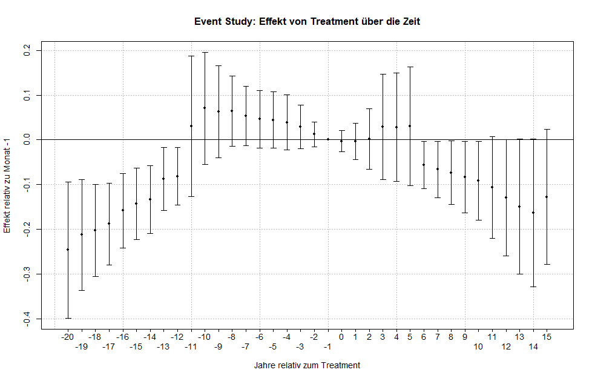

# 📊 Staggered Treatment Analysis of Food Prices
## Overview
This project investigates the impact of a fictional, staggered treatment on food prices across four countries using a staggered Difference-in-Differences (DiD) approach. The analysis incorporates two-way fixed effects and clustered standard errors, and is complemented by an event study to explore dynamic treatment effects over time.

## Data
The [data](data/Essen_daten_EU_(2000_2025).xlsx) was sourced from Eurostat and preprocessed in a separate script, which can be found [here](code/Data_preprocessing.R). The dataset includes monthly food price indices for the four countries under study.

## Methodology
### Visualization
A series of exploratory and analytical plots were created to visually assess the impact of the treatment over time.

  
  

### Staggered DiD Estimation
We applied a [staggered Difference-in-Differences](code/Ökonometrische_Analyse.R) model with:  
   - Two-way fixed effects (country and time),  
   - Clustered standard errors at the country level.

### Event Study
An event study was performed to track the treatment effect across different time leads and lags relative to treatment adoption.

  

## Output
All results, including tables and plots, are compiled and presented in two LaTeX documents provided in the [project directory](Analysis_Results).
